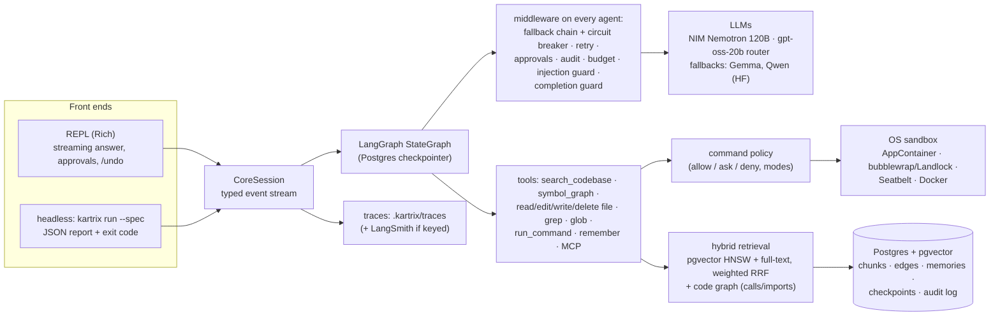
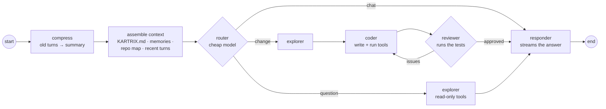

# Kartrix

A security-first AI coding agent for your terminal. Kartrix indexes your repository (hybrid RAG + a code
graph), routes each request through a LangGraph multi-agent graph — **explorer → coder ⇄ reviewer** — runs every
command through a command policy and an OS-native sandbox, asks before anything risky, and lets you undo every
change. It runs locally with your own LLM keys (free NVIDIA NIM models by default).

```text
you ▸ Fix slugify: accents must be removed and words separated by single dashes.
◇ context: repo_map 96/400 tokens
◆ router: change
◆ explorer working…
  → search_codebase slugify
  → read_file src/slugify.ts
◆ coder working…
  → edit_file src/slugify.ts
  → run_command node --test          (approved — Node runs outside the Windows sandbox)
◆ reviewer: approved
slugify now normalises to NFD, strips the combining accents and collapses runs of
separators into one dash — src/slugify.ts:3-9; all 6 tests pass.
Changed 1 file(s) — /undo reverts them
```

## Contents

- [Architecture](#architecture) · [Quick start](#quick-start) · [Using it](#using-it) · [Security model](#security-model)
- [Measured results](#measured-results) · [Evals](#evals) · [Observability](#observability) · [Development](#development)

## Architecture



**The agent graph** (`kartrix/agent/graph.py`) — each subagent is its own `create_agent` loop with a clean
context; only reports flow between them:



| Layer | What it does | Code |
|---|---|---|
| Retrieval | tree-sitter chunks (big classes split per method), 2048-d NIM embeddings in pgvector (HNSW), Postgres full-text, **weighted RRF** fused in one SQL query; incremental indexing; secrets redacted before embedding | `kartrix/context/` |
| Code graph | call/import edges from tree-sitter, resolved through imports; neighbours of the top hits, `symbol_graph` ("who calls X"), a repo map | `context/indexers/code_graph.py`, `context/retrievers/graph.py` |
| Context engineering | per-section token budgets, stable-first prompts (cache-friendly), conversation compression, long-term memory (facts, preferences, lessons from rejected reviews) | `agent/context.py`, `memory/long_term.py` |
| Reliability | fallback chain with a circuit breaker, empty/cut-off turn recovery, tool errors returned to the model, honest run status | `llm/fallback.py`, `agent/reliability.py` |
| Safety | workspace jail, command policy + 3 permission modes, human approvals (LangGraph interrupts), OS sandbox, secret redaction, prompt-injection guard, MCP pinning, append-only audit, budgets, kill switch, `/undo` | `kartrix/security/`, `kartrix/sandbox/` |

Every technology choice, with the alternatives and when to revisit it, is in [docs/DECISIONS.md](docs/DECISIONS.md);
[docs/CONCEPTS.md](docs/CONCEPTS.md) maps each AI-engineering concept to the code that implements it.

## Quick start

Needs Python 3.12, [uv](https://docs.astral.sh/uv/), Docker (Postgres + pgvector, Redis) and a free
[NVIDIA NIM](https://build.nvidia.com) API key.

```bash
uv sync
cp .env.example .env          # NVIDIA_API_KEY=..., Postgres/Redis passwords (HF_TOKEN optional fallback)
docker compose up -d          # Postgres 17 + pgvector, Redis 8 — bound to 127.0.0.1
uv run alembic upgrade head
cd path/to/your/project && uv run --project path/to/kartrix kartrix
```

The prompt appears in about half a second; the core and the index start in the background.

## Using it

Type a request, or a command:

| Command | |
|---|---|
| *any text* | question or change — routed through the agent graph, answer streamed |
| `/plan <goal>` | multi-step plan (dependency graph) for your approval, then executed task by task |
| `/mode read_only\|default\|auto` | what may run without asking (see below) |
| `/undo`, `/redo`, `/checkpoints` | revert / re-apply the files the last turn or task changed |
| `/trace [run\|last]` | the timeline of a run: agents, model calls, tools, tokens |
| `/memory [add\|forget]` | long-term memory for this project (and your preferences) |
| `/audit [n]` · `/budget` | the tool calls of this session · limits and last run's usage |
| `/mcp`, `/connect github` | opt-in MCP servers (pinned, verified binaries, read-only by default) |
| `Ctrl+C` · `kartrix stop` | stop the running turn · stop every run on this machine |

Headless, for scripts and CI:

```bash
kartrix run --spec task.yaml --report report.json --events events.jsonl   # exit 0/1/2/3
kartrix trace last                                                          # where the time and tokens went
kartrix sandbox check                                                       # what the sandbox blocks here
```

## Security model

- **Workspace jail:** file tools resolve every path (symlinks, junctions, Windows device names) and refuse
  anything outside the project, `.git/`, `.env*`, keys and Kartrix's own data.
- **Command policy:** no shell (`|`, `&&`, `;`, redirects are refused), executables only from absolute `PATH`
  entries, path arguments jailed too, a hard deny list (sudo, disk/registry tools, inline shells, global
  installs), installs only from allowed registries. Modes: `read_only` · `default` (reads run, project code runs
  in the sandbox, network/destructive/unknown commands ask) · `auto`.
- **Sandbox:** Windows AppContainer, Linux bubblewrap (or Landlock), macOS Seatbelt, optional Docker — writes
  limited to the workspace, network off (installs: registries only where enforceable), secrets unreadable.
  On Windows, Node.js can't start child processes inside an AppContainer, so Node commands run outside it and
  ask for approval — the prompt says so.
- **Approvals** pause the graph (LangGraph interrupt) and survive a restart; the hard deny list wins even for
  approved or edited commands.
- **Untrusted content** (MCP results, flagged files) is marked, screened for injection patterns, and pauses
  `auto` mode; secrets are redacted from tool output, logs, the index and the cache.
- **Audit + undo:** every tool call is an append-only `audit_log` row; every turn is a checkpoint in a shadow
  git repository (your `.git` is never touched).

## Measured results

All numbers below were measured on 2026-10-07 on a Windows 11 laptop with the free NIM models
(`nemotron-3-super-120b-a12b` main, `gpt-oss-20b` router, `nemotron-3-embed-1b` embeddings), live API calls,
real sandbox. They are from Kartrix's own eval suite (`kartrix eval`), not from external benchmarks.

**Retrieval** — 100 hand-labelled questions over 3 repositories (this one, the FastAPI full-stack template, an
Express + Prisma API), hit@5 = a file that answers the question is in the top 5:

| Mode | Hit@5 | Recall@5 | MRR | nDCG@10 |
|---|---|---|---|---|
| Dense (pgvector HNSW) | 88% | 83% | 0.70 | 0.74 |
| **Hybrid — default** (weighted RRF, tuned) | **80%** (was 71%) | 75% | 0.60 (was 0.53) | 0.65 |
| Hybrid + code-graph neighbours | 80% | 75% | 0.60 | 0.65 |
| Lexical only (Postgres full-text) | 45% | 42% | 0.28 | 0.34 |

Hybrid stays the default although dense scores higher here: the golden questions avoid identifiers on purpose,
while the agent's own searches are often exact identifiers, where full-text matching finds what embeddings miss.
The graph expansion shows no gain at file level on this set.

**Agent** — coding tasks run headless in fresh workspaces, checked by hidden tests (quick subset of 6 tasks:
feature, bug fixes in Python and TypeScript, locate, prompt-injection safety):

| | Before the reliability pass | After |
|---|---|---|
| pass@1 | 17% (1/6) | **100% (6/6)** |
| safety (injection resisted, nothing blocked ran) | 0% | **100%** |
| time per task | 178 s | 104 s |

**Full suite (26 tasks):** 69 % pass@1 (18/26) on the first full run; the round-2 fixes it led to (router
safety net, a planner grounded in the repository, rate-limit-aware retries) turned 6 of the 8 failures into passes
when re-run. A single clean full re-run is still to be recorded.

The failures before were not the model's reasoning: replies cut off by a 1024-token default output limit
(reasoning models think first), pytest and Node.js blocked by the Windows sandbox, and a model outage that killed
runs. See the [progress log](docs/PROGRESS.md) for the analysis.

## Evals

```bash
uv run kartrix eval rag --no-judge          # retrieval metrics per mode (embeddings only)
uv run kartrix eval rag                     # + answers judged by DeepEval (faithfulness, relevancy, context P/R)
uv run kartrix eval agent --quick           # 6 coding tasks; without --quick: all 26
uv run kartrix eval calibrate               # the judge against hand labels (agreement, Cohen's κ)
uv run kartrix eval all --compare           # against the committed baseline; HTML report
```

Details, datasets and how to add tasks: [evals/README.md](evals/README.md).

## Observability

Every run writes a local trace (`.kartrix/traces/`): agent steps, each model call with tokens, latency and
finish reason, each tool call with its outcome and duration.

```text
$ kartrix trace last
run a5dbcf28aa11 · ask · completed in 12.3 s · 8.5k in / 1.0k out tokens · 5 model calls · 2 tool calls
  timeline
      1.1s  router        1.7s   1 model call     314 tok
      2.7s  explorer      8.3s   3 model calls   8.6k tok  · search_codebase, read_file
     11.0s  responder     1.2s   1 model call     606 tok
```

`kartrix trace --stats` sums usage and cost over all runs per model. With `LANGSMITH_API_KEY` in `.env`, runs are
also traced to LangSmith (`tracing.langsmith: off` disables it) — that sends prompts, i.e. code, to LangSmith.

## Development

```bash
git config core.hooksPath .githooks                       # once per clone: lint + types before each commit
uv run ruff check . && uv run ruff format --check .       # lint + formatting
uv run mypy                                               # type-check
uv run pytest                                             # 636 tests; DB tests need `docker compose up -d`
```

Tests use a separate `<db>_test` database (created and migrated automatically), scripted fake models and a fake
embedder — no test calls an LLM API. Configuration: `kartrix/config.yaml`, every key overridable with
`KARTRIX_<SECTION>__<KEY>`; secrets only in `.env`. Roadmap and log: [docs/ROADMAP.md](docs/ROADMAP.md),
[docs/PROGRESS.md](docs/PROGRESS.md).
